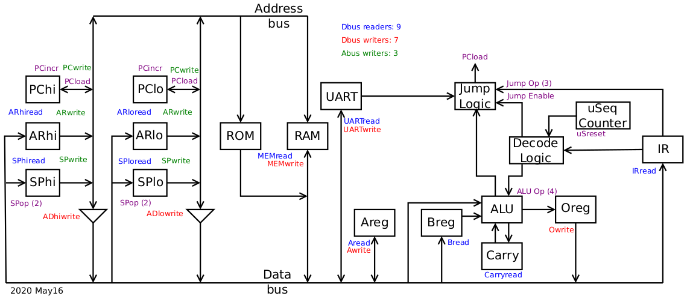
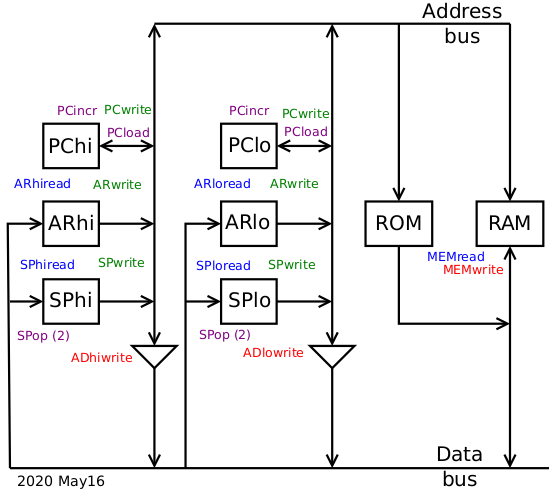
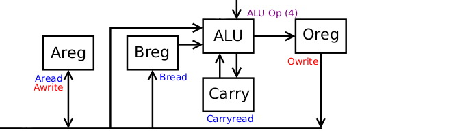
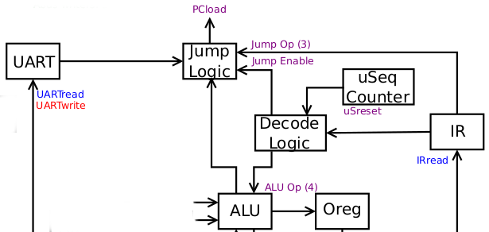

# FISC: An 8-bit TTL CPU



FISC is an 8-bit microseqenced CPU wth a 64K address space built from
discrete TTL-level components. It provides:

 + recursive **F**unctions,
 + **I**ndexed addressing and
 + **S**tack operations

as well as the usual load/store and arithmetic operations, comparisons,
branches and jumps.

## The Address Bus



The address bus is 16 bits wide and provides a 64Kbyte address space. The
bottom 8K is mapped to a ROM, and the remaining 56K is RAM.

Three components can write to the address bus:

 1. The Program Counter (PC)
 2. The Address Register (AR)
 3. The Stack Pointer (SP)

All three are divided into 8-bit high and low registers. This allows the
Address Register and Stack pointer halves to write to and read from the
8-bit data bus. The PC can only load from the address bus.

The PC provides the address of the next instruction in memory. It can load
a new value (i.e. jump), increment to the next address or hold its value.

The AR provides the address for data items in memory. It can load a new
value or hold its value.

The SP points at a location in memory where data can be pushed or popped.
It can load a new value, increment, decrement or hold its value.

## The Data Bus



The data bus is 8 bits wide and provides the path for data movement, e.g.

 + data loads from memory into registers
 + data stores to memory from registers
 + ALU operations on data
 + updates to the AR and SP registers
 + I/O to the UART (shown in the overall block diagram at the top)

The ALU provides 16 operations on two data inputs, of which one is always
the B register. The other data input is the data bus itself: this allows
the ALU input to be one of:

 + the 8-bit halves of the AR and SP registers
 + the A register
 + a memory location
 + the UART

The ALU's data output is buffered by the 8-bit O register. This allows
instructions like `<address> = <address> + B` to be performed using a
sequence of microinstructions.

The Carry register records the carry of an ALU addition or subtraction
of an ALU operation. This information can then be used by following
additions and subtractions. When performing a comparison between two operands,
the ALU also outputs information about the comparison which is used for
conditional jump and branch instructions.

## Indexed Addressing

As the AR and SP registers can write to and read from the data bus,
we can use the ALU along with the Address Register (AR) to perform indexed
addressing. Consider the load operation `A= <address>,B`, and assume that
AR and B are already loaded with the address and offset. This sequence of
microinstructions will perform the indexed load:

```
  Oreg = ARlo + B, carry recorded in Carry register
  ARlo = Oreg
  Oreg = ARhi + 0, previous carry brought in
  ARhi = Oreg
  A = Memory[ AR ]
```

## Stack Operations

At boot time, the 16-bit Stack Pointer is initialised to $0000 so
that the first push on the stack will occur at $FFFF, i.e.
the top of memory. The Stack Pointer can increment and decrement itself without
requiring the ALU. Let's look at how we can push the A register on the stack.
This would be performed by this sequence of microinstructions:

```
  SP--
  Memory[ SP ] = A
```

Similarly, popping a value from the stack and into the A register
would be performed by this sequence of microinstructions:

```
  A= Memory[ SP ]
  SP++
```

The Stack Pointer is connected to the data bus in the same way as the
Address Register, and the Stack Pointer can be loaded from the data bus.
This allows functions to have local variables and arguments. Consider
a function with two 8-bit arguments (`arg1` and `arg2`) and three 8-bit
local variables (`loc1`, `loc2` and `loc3`). We can arrange the stack
to look like this:

```
        | arg2 |   SP,3
        +------+
        | arg1 |   SP,2
        +------+
        |  Old |
        +      +
  SP -> | PC+1 |
        +------+
        | loc3 |   SP,-1
        +------+
        | loc2 |   SP,-2
        +------+
        | loc1 |   SP,-3
        +------+
```

The five variables can be accessed using indexed addressing with the Stack
Pointer as the base, as shown in the right-hand column above.

## Function Calls

FISC provides function calls where the return address is stored on the
stack. There are two instructions: JSR to jump to a subroutine and RTS
to return from the subroutine.

Given that the Program Counter will increment itself as part of each
instruction, the sequence of microinstructions for JSR is:

```
  SP--
  Memory[ SP ] = PChi
  SP--
  Memory[ SP ] = PClo
```

and the sequence of microinstructions for RTS is:

```
  PClo = Memory[ SP ]
  SP++
  PChi = Memory[ SP ]
  SP++
```

## Control Logic



The control logic block diagram for FISC is shown in the above image.
Each instruction is one byte, followed by zero or more bytes that
encode addresses, constant values, offsets etc.

FISC is a microsequenced CPU with up to sixteen microinstructions per
high-level instruction. The microsequence counter starts at zero and
counts up to fifteen, but it can be reset to zero by the Decode Logic.

On microinstruction zero, the Instruction Register is loaded from memory
over the data bus:

```
  IR = Memory[ PC++ ]
```

The Instruction Register and the microsequence counter form a lookup
address to choose the next microinstruction in the Decode Logic.

Four bits from the Decode Logic are sent to the ALU as the
operation to perform, and the O register always records the result of
this operation. Thus, on every microinstruction the ALU makes a calculation
which is stored in the O register.

However, the Decode Logic controls when the O register writes to the data
bus, and when the Carry register records the carry output bits from the ALU
operation. This allows us to selectively use the ALU as required.

When doing a comparison, the ALU generates six bits which are sent to the
Jump Logic:

 + Zero
 + Not Zero
 + Negative
 + Negative or Zero
 + Not Negative, Not Zero
 + Zero or Not Negative

The ALU compares two operands by subtracting the second operand from the
first. The above outputs can be used to make these decisions:

 + `operand1 == operand2`, when `operand1 - operand2` is zero
 + `operand1 != operand2`, when `operand1 - operand2` is not zero
 + `operand1 < operand2`, when `operand1 - operand2` is negative
 + `operand1 <= operand2`, when `operand1 - operand2` is negative or zero
 + `operand1 > operand2`, when `operand1 - operand2` is not negative, not zero
 + `operand1 >= operand2`, when `operand1 - operand2` is zero or not negative

As with the ALU, the Decode Logic controls when the Jump Logic output
actually modifies the Program Counter's value. So even though the Jump
Logic is always evaluating the comparison bits from the ALU, we
won't jump unless the Decode Logic tells us to.

### The Decode Logic

The Decode Logic outputs sixteen control bits. Some of these are demultiplexed
to provide many more control bits. We have already seen that the ALU operation
and the Jump operation are provided directly by the instruction.

At present, these are the control bits provided by the Decode Logic:

 + ALU operations (4 bits, 3:0)
 + Data bus writers (3 bits, 6:4), shown in red in the block diagrams
 + Address bus writers (2 bits, 8:7), shown in green in the block diagrams
 + Data bus readers (4 bits, 12:9), shown in blue in the block diagrams
 + Stack operation (2 bits, 14:13), shown in purple in the block diagrams
 + Microsequencer reset (1 bit, 15)

As there are less than sixteen components that read from the data bus,
one of the sixteen data bus reader bit patterns indicates to load the
Carry register. Another pattern indicates to perform a jump when required.

As there are less than four stack operations, one of the four stack operation
patterns controls when the PC increments.
