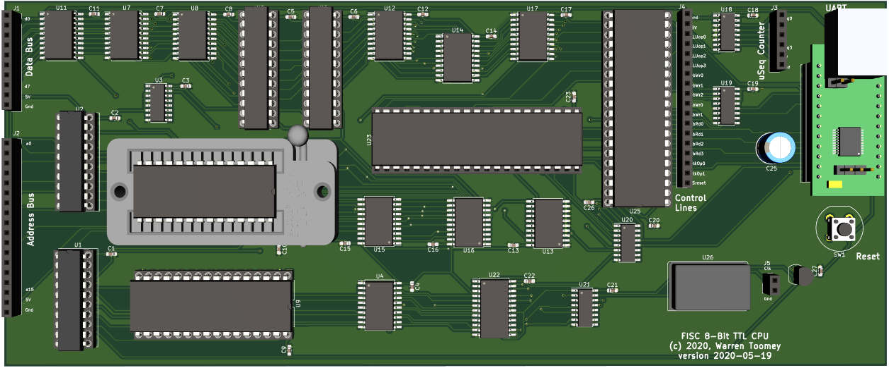

# FISC: An 8-bit TTL CPU with a Stack Register

FISC is an 8-bit microseqenced CPU wth a 64K address space built from
discrete TTL-level components. It provides:

 + recursive **F**unctions,
 + **I**ndexed addressing and
 + **S**tack operations

as well as the usual load/store and arithmetic operations, comparisons,
branches and jumps.

The design uses 25 chips and has 8K of ROM, 56K of RAM and a UART.

## Documentation

The overall design of the CPU is covered in
[Docs/arch_overview.md](Docs/arch_overview.md), and some details
of the expected hardware implementation are in 
[Docs/fisc_implementation.md](Docs/fisc_implementation.md).

## Implementation

At present, I have:

 + a Perl CPU simulator, [csim](csim)
 + an assembler, [cas](cas)
 + a simple compiler, [clc](clc)
 + example assembly and higher-level programs in [Examples](Examples)
 + a Verilog design in [Verilog](Verilog)
 + an initial schematic in [Kicad/schematic.pdf](Kicad/schematic.pdf)

## Status of the CPU

**mid-June, 2020**: The PCBs have arrived and I've soldered on about
two thirds of the components. So far, only one wiring mistake. The
CPU can output data from the ROM to the UART and loop. Next will be
the registers and the RAM.

For more detail on progress, you can read my [journal](Docs/journal.md).
